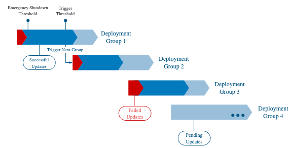
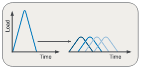

# IoT. Update. Device.

Eclipse hawkBit™ is a domain independent back-end framework for rolling out software updates to constrained edge devices as well as more powerful controllers and gateways connected to IP based networking infrastructure.

  

---

## Interfaces

Eclipse hawkBit™ provides three APIs, each designed to support specific integration requirements for device connectivity, device management, and external service federation.

### Management API

The Management API is a RESTful interface that allows Create, Read, Update, and Delete (CRUD) operations for provisioning targets (e.g., devices) and repository content (e.g., software). Using the Management API, you can manage and monitor software update processes. It supports JSON payloads with Hypermedia and offers filtering, sorting, and pagination capabilities

The following sections provide a high-level overview. For in-depth information, including request flows and examples, see the [Management API documentation](#management-api)

### Direct Device Integration (DDI) API

The Direct Device Integration (DDI) API is built on HTTP standards and uses a polling-based approach.

Eclipse hawkBit™ exposes RESTful resources that devices consume to retrieve software update tasks, including artifact partial and resume downloads (RFC7233), and to report back status and feedback. 

The DDI API supports ETag-based traffic optimization, allowing devices to efficiently check for updates without unnecessary data transfer.

Learn more in the [DDI API documentation](direct-device-integration-api.md)

### Device Management Federation (DMF) API

The Device Management Federation (DMF) API enables indirect device integration via a device management service into hawkBit. It is a message-based, asynchronous API optimized for high-throughput cloud service-to-service communication. The DMF API leverages RabbitMQ messaging and provides strong tenant isolation through dedicated AMQP virtual hosts per tenant.

For a detailed description and usage examples, see the [Device Management Federation (DMF) API documentation](device-management-federation-api.md)

---

## Device Repository

- **Device State Storage**: The Device Repository manages connected devices (targets) and their state. It allows you to retrieve device details and attributes, maintain descriptions, metadata, tags, and track assigned and installed software versions, including software update status.
- **Tagging**: hawkBit™ allows creating and managing arbitrary tags that can be assigned to devices. These tags become part of the target metadata and can be used as a simple, flexible way to filter and group devices in both the UI and API
- **Filtering and Grouping**: Advanced device management is enabled through Target Filters, which group devices based on query criteria. These filters not only simplify device organization but also support automatic update assignments - for example, newly registered devices that match a filter are automatically assigned the corresponding software update.

## Software Repository
#### Distribution Sets and Software Modules
The software repository organizes and manages software updates. A software update, called a Distribution Set, is composed of one or more Software Modules, each containing multiple artifacts.

**Structure**:
- **Distribution Set**: Complete software package for deployment
  - Version controlled
  - Can contain multiple software modules
  - Distribution set types (OS, Application, Firmware, etc.)
- **Software Module**: Individual software component
  - Contains one or more artifacts (files)
  - Software module types (customizable)
  - Mandatory vs. optional designation
- **Artifact**: Binary files with metadata
  - Multiple hash algorithms (MD5, SHA1, SHA256)
  - Encryption support
  - Signature support

Metadata can be assigned to both Software Modules and Distribution Sets.

#### Tagging and Filtering
hawkBit™ lets you assign user‑defined tags to Distribution Sets and then filter Distribution Sets using those tags, making it easier to organize and locate updates based on custom criteria.

#### Locking After Assignment

To ensure consistency and prevent unintended changes, hawkBit™ supports locking of Distribution Sets after they have been assigned to a target (device or group). When a distribution set is locked, all its software modules are automatically locked, and they cannot be modified until they are unlocked. This provides stability for ongoing deployments, ensuring that the software being rolled out remains consistent throughout the deployment process.

#### Required Migration Step Flag

When creating a Distribution Set, you can set a flag to indicate that applying this update requires a migration step on the device. This is useful for ensuring data migration, configuration changes, or other necessary steps are performed during the update process to ensure a successful transition.

## Artifact Content Delivery

The Artifact Content Delivery component manages the storage and delivery of software artifacts to devices. It supports partial and resumable downloads using RFC7233 range requests, allowing devices to efficiently retrieve large files even in unreliable network conditions. The content management is accessible via RESTful APIs and the UI, with authorization based on software assignment to ensure that devices can only download artifacts they are authorized for.

## Rollout Management

Rollout Management in Eclipse hawkBit™ is a core feature designed to orchestrate and control the deployment of software updates to large fleets of devices in a safe, flexible, and automated way.

It enables group-based deployments with configurable success and error thresholds. Groups can cascade based on the status of previous groups.

The traditional “big bang” approach updates all devices at once, creating a sharp load spike and risking infrastructure overload, while hawkBit’s phased rollout spreads updates across smaller groups over time, smoothing load and maintaining system stability.

Rollouts can be started, paused, resumed, stopped, or retried, with real-time monitoring and emergency stop features.
Devices can be added dynamically, and detailed status tracking is available for each rollout stage.

To explore software update in greater detail, visit [Rollout Management documentation](rollout-management.md)

## Reporting and Monitoring

Eclipse hawkBit™ provides real-time visibility and historical insight into how software updates are rolled out, executed, and completed across large device fleets. Reporting and monitoring are tightly coupled to its rollout and device management model.

#### Monitoring Features
- **Rollout Progress Tracking**: Monitor deployment stages, group completion, and cascading group triggers
- **Action States**: Track individual device update actions (pending, running, finished, error, canceled)
- **Action History**: Monitor the status of every device via its action history. This action history makes transparent which action happened at which particular time and with its result.
- **Success/Error Thresholds**: Configure and monitor threshold violations that can pause or stop rollouts
- **Device Connectivity**: Track device polling activity, last seen timestamps, and overdue detection
- **Download Progress**: Monitor artifact download status and completion rates

#### Reporting Channels
- **Management API**: RESTful endpoints for querying device status, action history, and rollout metrics
- **Event System**: Publish events for entity changes, action status updates, target polling, and download progress
- **RabbitMQ Events**: Remote events for distributed monitoring and integration with external tools

## Authentication & Security

Eclipse hawkBit™ provides comprehensive authentication and security features to protect devices, management interfaces, and data. All communication is protected using TLS/HTTPS, and update delivery is restricted to authenticated devices. hawkBit also records deployment and action history for traceability and auditing. While it keeps built-in security mechanisms focused and lightweight, hawkBit is designed to integrate easily with external identity, logging, and security systems for production use.

If you’d like to explore security controls in more detail, check out the [Authentication](authentication.md) and [Authorization](authorization.md) documentation.