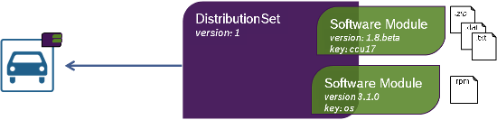

# IoT. Update. Device.

Eclipse hawkBit™ is a domain independent back-end framework for rolling out software updates to constrained edge devices as well as more powerful controllers and gateways connected to IP based networking infrastructure.

  

---

## Interfaces

hawkBit offers a direct device integration via HTTP or a device management federation API which allows to connect devices with different protocol adapter. Users can make use of the graphical user interface and other service can interact with hawkBit through the RESTful management API.

---

## Rollout

hawkBit supports an easy and flexible rollout management which allows you to update a large amount of devices in separated groups.

- Cascading start of the deployment groups based on installation status of the previous group.  
- Emergency shutdown of the rollout in case a group exceeds the defined error threshold.  
- Rollout progress monitoring for the entire rollout and the individual groups.  

---

## Package Model

A software update does not always contain only a single file.  
The hawkBit meta model allows you to configure your files in virtual software and distribution packages.  

