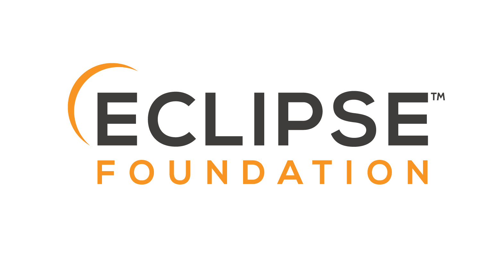

- Getting Started
  - [Overview](README.md)
  - [What is hawkBit](what-is-hawkbit.md)
  - [Quick Start](quick-start.md)
  - [Features](features.md)
  - [Architecture](architecture.md)

- Guides
  - [Base Setup](base-setup.md)
  - [SDK](hawkbit-sdk.md)
  - [Feign Client](feign-client.md)
  - [Clustering](clustering.md)
  
-Concepts
  - [Authentication](authentication.md)
  - [Authorization](authorization.md)
  - [Data model](datamodel.md)
  - [Rollout management](rollout-management.md)
  - [Targets state](targetstate.md)

- APIs
  - [Management API](management-api.md)
  - [Direct Device Integration API](direct-device-integration-api.md)
  - [Device Management Federation API](device-management-federation-api.md)
  
- [Release notes](release-notes.md)

- 
- 
<!--- -->

<!--
- 
- 
- 
-->

- 

- 

- [Privacy Policy](http://www.eclipse.org/legal/privacy.php)
- [Terms of Use](http://www.eclipse.org/legal/termsofuse.php)
- [Copyright Agent](http://www.eclipse.org/legal/copyright.php)
- [Legal](http://www.eclipse.org/legal)
- [License](https://www.eclipse.org/org/documents/epl-2.0/EPL-2.0.txt)
- **© 2025 The Eclipse hawkBit Project**

  

