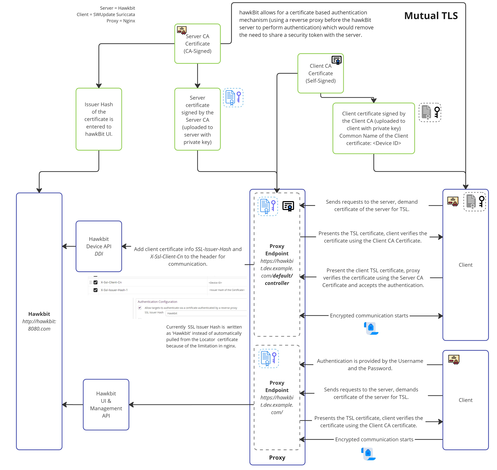

# Authentication

A hawkBit update server can be accessed in four different ways:

- _Direct Device Integration (DDI) API_ by **targets**.
- _Management API_ by 3rd party **applications**.
- _Device Management Federation (DMF) API_ by 3rd party **applications** through AMQP.

---

## DDI API Authentication Modes

### Security Token

hawkBit supports multiple ways to authenticate a target against the server. The different authentication modes can be
individual enabled and disabled within hawkBit. Both on system level (with Spring Boot properties) as per individual
tenant.

#### Target Security Token Authentication

If not set by the user, the security token is automatically generated with 32 alphanumeric characters. 
However, the user can provide a custom token with a maximum length of 128 alphanumeric characters.
This token can be used to authenticate the target at hawkBit through the HTTP-Authorization Header with the custom scheme _TargetToken_.

```http
GET /DEFAULT/controller/v1/0e945f95-9117-4500-9b0a-9c6d72fa6c07 HTTP/1.1
Host: your.hawkBit.server
Authorization: TargetToken bH7XXAprK1ChnLfKSdtlsp7NOlPnZAYY
```

The target security token is provided in **DMF API** as part of the update message in order to allow
DMF clients to leverage the feature or can it be manually retrieved per target
by **Management UI** or in the **Management UI** in the target details.

Note: needs to be enabled in your hawkBit installation (See [DdiSecurityProperties](https://github.com/eclipse-hawkbit/hawkbit/blob/master/hawkbit-security-core/src/main/java/org/eclipse/hawkbit/security/DdiSecurityProperties.java)
for system-wide enablement) **and** in the tenant configuration (set [TenantConfigurationProperties](https://github.com/eclipse-hawkbit/hawkbit/blob/master/hawkbit-repository/hawkbit-repository-api/src/main/java/org/eclipse/hawkbit/tenancy/configuration/TenantConfigurationProperties.java)#TenantConfigurationKey.AUTHENTICATION_MODE_TARGET_SECURITY_TOKEN_ENABLED, _authentication.targettoken.enabled_ to true). That allows both the
operator and the individual customer (if run in a multi-tenant setup) to enable this access method.

#### Gateway Security Token Authentication

Often the targets are connected through a gateway which manages the targets directly and as a result are indirectly
connected to the hawkBit update server.

To authenticate this gateway and allow it to manage all target instances under its tenant there is a _GatewayToken_ to
authenticate this gateway through the HTTP-Authorization header with a custom scheme _GatewayToken_. This is of course
also handy during development or for testing purposes. However, we generally recommend to use this token with care as it
allows to act _in the name of_ any device.

```http
GET /DEVICE/controller/v1/0e945f95-9117-4500-9b0a-9c6d72fa6c07 HTTP/1.1
Host: your.hawkBit.server
Authorization: GatewayToken 3nkswAZhX81oDtktq0FF9Pn0Tc0UGXPW
```

Note: needs to be enabled in your hawkBit installation (See [DdiSecurityProperties](https://github.com/eclipse-hawkbit/hawkbit/blob/master/hawkbit-security-core/src/main/java/org/eclipse/hawkbit/security/DdiSecurityProperties.java)
for system-wide enablement) **and** in the tenant configuration (set [TenantConfigurationProperties](https://github.com/eclipse-hawkbit/hawkbit/blob/master/hawkbit-repository/hawkbit-repository-api/src/main/java/org/eclipse/hawkbit/tenancy/configuration/TenantConfigurationProperties.java)#TenantConfigurationKey.AUTHENTICATION_MODE_GATEWAY_SECURITY_TOKEN_ENABLED, _authentication.gatewaytoken.enabled_ to true). That allows both the
operator and the individual customer (if run in a multi-tenant setup) to enable this access method.

### Certificate Authentication by Reverse Proxy

hawkBit offers a certificate-based authentication mechanism, also known as mutual TLS (mTLS), which eliminates the need
to share a security token with the server. To implement this, you'll require a reverse proxy deployed in front of the
hawkBit server to handle authentication. This process involves obtaining certificates (and keys) for both the client and
the reverse proxy and configuring hawkBit accordingly.

Initially, you'll need to obtain certificates (and keys) for these components from the same or different Certificate
Authorities (CAs). Once you have acquired certificates you have to set them up to both the client and the hawkBit
server.

Then you shall enable *Allow targets to authenticate via a certificate authenticated by a reverse proxy* and set the
fingerprint of the client certificate issuer(s) (as a comma separated list).

To authenticate the request to hawBit the following condition shall be met:

- the common name of the client certificate shall match the controller/client id
- the TLS Issuer(s) hash of the presented client certificate shall be set for the tenant. 

For that you shall:
- enable header authentication in the tenant configuration - set [TenantConfigurationProperties](https://github.com/eclipse-hawkbit/hawkbit/blob/master/hawkbit-repository/hawkbit-repository-api/src/main/java/org/eclipse/hawkbit/tenancy/configuration/TenantConfigurationProperties.java)#TenantConfigurationKey.AUTHENTICATION_MODE_HEADER_ENABLED, _authentication.header.enabled_ to true. 
- set / configure the issuer, for the tenant, in the tenant configuration - set [TenantConfigurationProperties](https://github.com/eclipse-hawkbit/hawkbit/blob/master/hawkbit-repository/hawkbit-repository-api/src/main/java/org/eclipse/hawkbit/tenancy/configuration/TenantConfigurationProperties.java)#AUTHENTICATION_MODE_HEADER_AUTHORITY_NAME.AUTHENTICATION_MODE_HEADER_ENABLED, _aauthentication.header.authority_ to issuer hash.

  You can use the following command to get the issuer hash
  ```shell
  openssl x509 -in client_certificate.crt -issuer_hash -noout`
  ```

Here is an example diagram that shows all the communication between the hawkBit, reverse proxy and client. For the sake
of simplification we assume that there are not intermediate certificates and the certificate and key are as follows:

- client_ca.crt signs client.crt
- server_ca.crt signs server.crt

- client has the client.crt, client.key and server_ca.crt
- server (in this case reverse proxy) has the server.crt, server.key and client_ca.crt

<p align="center">
  
</p>

#### Example - Nginx Reverse Proxy Configurations

Nginx doesn't support obtaining the issuer hash without addons. Therefore, in this example we bypass sending real SSL
Issuer hash to hawhBit but do certificate issuer validation at Nginx and then supply shared (between Nginx and hawkBit)
fixed hash "Hawkbit". You could use any value here as long as it is matched with the *Allow targets to authenticate via
a certificate authenticated by a reverse proxy* setting in the hawkBit UI. Note that for multi-tenant scenarios with
different trusted CAs this example won't work.

1. Hawkbit Configurations

   There are also some configurations that you need update when you deployed your hawkbit service.

   You need to add the given setting to your hawkBit configurations so that hawkBit can generate the URLs according to
   the https that the client will use to download. If you're deploying hawkBit as a Docker container, add these
   configurations as environmental values in the docker-compose.yml file.

```properties
server.forward-headers-strategy=NATIVE
```

2. In Hawkbit's UI section, under system configuration, make sure to select *Allow targets to authenticate via a
   certificate authenticated by a reverse proxy* and input the fixed issuer hash as "Hawkbit". This can be whetever you
   have configured in the nginx configuration in `proxy_set_header X-Ssl-Issuer-Hash-1` below.

3. After placing your certificates and keys, you need to deploy your proxy server and apply the provided configurations.
   You can apply mutual TLS specifically to the URL given below to implement the process only for devices using the
   Device Integration API:

   `hawkbit.dev.example.com/default/controller/`

   This ensures that other clients, like UI users, can connect to hawkBit without requiring client certificates. They
   can use Username and Password in the Management API, eliminating the need for authentication and making it more
   user-friendly.

```nginx
# Nginx Hawkbit Configurations

# Gets the Common Name of the certificate from the client certificate. 
map $ssl_client_s_dn $ssl_client_s_dn_cn {
    default "";
    ~CN=(?<CN>[^,]+) $CN;
}

server {
    listen 80;
    listen [::]:80;

    server_name hawkbit.dev.example.com www.hawkbit.dev.example.com;
    server_tokens off;

    location /.well-known/acme-challenge/ {
        root /var/www/certbot;
    }

    location / {
        return 301 https://hawkbit.dev.example.com$request_uri;
    }
}

server {
    listen 443 ssl;
    listen [::]:443 ssl;

    server_name hawkbit.dev.example.com;

    ssl_certificate /etc/nginx/ssl/live/hawkbit.dev.example.com/server.crt;
    ssl_certificate_key /etc/nginx/ssl/live/hawkbit.dev.example.com/server.key;

    ssl_client_certificate /etc/nginx/client-cer/client_ca.crt;
    ssl_verify_client      optional;
    ssl_verify_depth 3;


   # For devices that is using device integration API, 
   # Mutual TLS is required.
   location ~*/.*/controller/ {
        if ($ssl_client_verify != SUCCESS) {
           return 403;
        }

        proxy_pass http://hawkbit.dev.example.com:8080;
        proxy_set_header Host $http_host;
        proxy_set_header X-Real-IP $remote_addr;
        proxy_set_header X-Forwarded-For $proxy_add_x_forwarded_for;

        # Client certificate Common Name and Issuer Hash is required
        # for auth in hawkbit. 
        proxy_set_header X-Ssl-Client-Cn $ssl_client_s_dn_cn;
        proxy_set_header X-Ssl-Issuer-Hash-1 Hawkbit;

        # These are required for clients to upload and download software. 
        proxy_request_buffering off;
        client_max_body_size 1000m;
   }

   # For clients that is using UI or Management API
   location / {
        proxy_pass http://hawkbit.dev.example.com:8080;
        proxy_set_header Host $http_host; 
        proxy_set_header X-Real-IP $remote_addr;
        proxy_set_header X-Forwarded-For $proxy_add_x_forwarded_for;
	    proxy_request_buffering off;
	    client_max_body_size 1000m;
   }   
}
```

4. To deploy Nginx, you could use a `.yml` file. Here's an example `docker-compose.yml` file for Nginx Docker.

```yml
version: '3'

services:
  webserver:
    image: nginx:latest
    ports:
      - 80:80
      - 443:443
    restart: always
    volumes:
      - ./nginx/conf/:/etc/nginx/conf.d/:ro
      - ./certbot/www:/var/www/certbot/:ro
      - ./certbot/conf/:/etc/nginx/ssl/:ro
      - ./client-cer/:/etc/nginx/client-cer/
      - ./landing-page/:/etc/webserver/landing-page
  certbot:
    image: certbot/certbot:latest
    volumes:
      - ./certbot/www/:/var/www/certbot/:rw
      - ./certbot/conf/:/etc/letsencrypt/:rw
```

`/client-cer/:/etc/nginx/client-cer/` is the designated location for the certificate authority that has signed the
client certificate. The presented client certificate will be verified against this CA.

5. After successfully generating your certificates with the correct chain, deploying your Nginx and Hawkbit services
   with appropriate configurations, and updating the settings on the device side, you will be able to establish a
   certificate-based authentication mechanism. This will eliminate the necessity of sharing a security token with the
   server.

&nbsp;

##### Swupdate Suricatta Configurations

If the client is utilizing the SWUpdate Suricatta service, the configurations on the device or client side should also
be adjusted as follows. Remember to change id, url and certificate names to your needs.

The location of the config file is `/etc/swupdate/swupdate.conf`

```yml
suricatta :
{
tenant = "default";
id = "device_id";
url = "https://hawkbit.dev.example.com";
nocheckcert = false;
cafile = "server_ca.crt";
sslkey = "/etc/ssl/certs/client.key";
sslcert = "/etc/ssl/certs/client.crt";
};
```

If your client service is a linux, you can use the command bellow to see the logs produced by the swupdate.

```shell
journalctl --follow -u swupdate
```

&nbsp;

##### Testing

You can test the communication by using the Curl command below to see if you successfully implemented mutual TLS:

```shell
curl -L -v --cert client.crt --key client.key --cacert server_ca.crt https://hawkbit.dev.example.com/default/controller/v1/{device-id}
```

In the UI, after uploading an SWU package and requesting a firmware update, you can use the link below to attempt to
install the software package.

```
curl -L -v --cert client.crt --key client.key --cacert server_ca.crt https://hawkbit.dev.example.com/default/controller/v1/{device-id}/softwaremodules/{artifact-id}/artifacts/hawkbit_updated_5.swu --output outputfile
```

---

## DMF API

Authentication is provided by _RabbitMQ_ [vhost and user credentials](https://www.rabbitmq.com/access-control.html) that
is used for the integration.

---

## Management API

- Basic Auth
