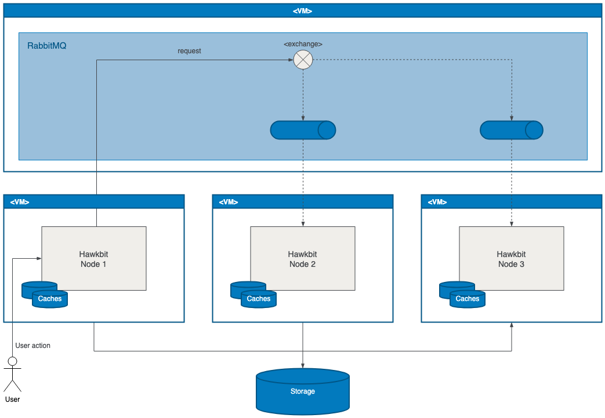
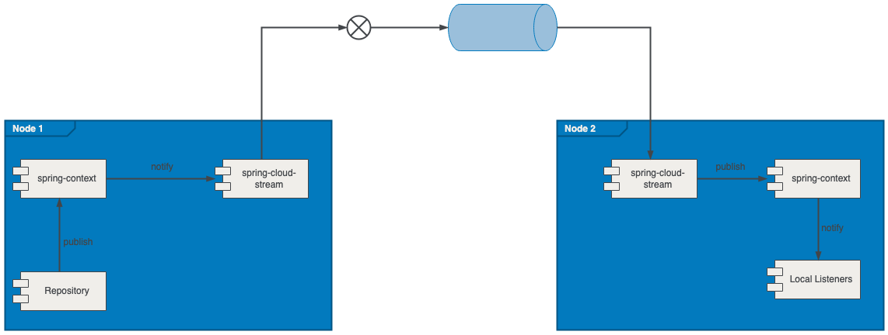

# Clustering

hawkBit is able to run in a cluster with some constraints. This guide provides insights into the basic
concepts and how to setup your own cluster. You can find additional information in the hawkBit runtime’s [README](https://github.com/eclipse-hawkbit/hawkbit/blob/master/hawkbit-monolith/hawkbit-update-server/README.md).

---

### Big picture
<p align="center">
  
</p>

---

### Events

Event communication between nodes is based on [Spring Cloud Stream](http://docs.spring.io/spring-cloud-stream/docs/current/reference/htmlsingle/).  
There are different [binder implementations](https://docs.spring.io/spring-cloud-stream/docs/current/reference/html/#_binders) available. The hawkbit Update Server uses **RabbitMQ binder**. 
Every node gets its own queue to receive cluster events, the default payload is JSON.


<p align="center">
  
</p>

#### Event Channel Types in Spring Cloud Stream

Remote events in hawkBit are distributed through two distinct types of channels:

##### Fanout Event Channel
   - Every service instance listening to fanoutEventChannel receives a copy of every message, regardless of instance count. 
   - Common for events that should be processed by each consumer independently
     - In-memory cache updates
     - Internal state propagation
     - Logging or auditing
   - Not recommended for scenarios where only one consumer should process an event (see serviceEventChannel for that).

**Note**: Every instance bound to this channel will get its own copy of the message.

##### Service Event Channel
The `serviceEventChannel` is used to ensure exclusive consumption of events across service instances. Only one instance per consumer group receives and processes each message, which is critical for non-idempotent or resource-sensitive operations. 
   - Only one instance in a consumer group receives each message. 
   - Ideal for external integrations, third-party API calls, or any task that must not be duplicated. 
   - Load-balanced across instances within the same group.

##### Optional Protostuff for Spring cloud stream

The micro-service instances are configured to communicate via Spring Cloud Stream. Optionally, you could use [Protostuff](https://github.com/protostuff/protostuff) based message payload serialization for improved performance.

**Note:** If Protostuff is enabled it shall be enabled on all microservices!

Add/Uncomment to/in your `application.properties` :

```properties
spring.cloud.stream.default.content-type=application/binary+protostuff
```

Add to your `pom.xml` :

```xml
<dependency>
    <groupId>io.protostuff</groupId>
    <artifactId>protostuff-core</artifactId>
</dependency>
<dependency>
    <groupId>io.protostuff</groupId>
    <artifactId>protostuff-runtime</artifactId>
</dependency>
```

---

### Caching

Every node is maintaining its own caches independent of the other nodes.  
So there is no globally shared/synchronized cache instance within the cluster.  

In order to keep nodes in sync, a **TTL (time to live)** can be set for all caches to ensure that after some time the cache is refreshed from the database.  
To enable the TTL just set the property `hawkbit.cache.global.ttl` (value in dDhHmMsS format).  

---

### Schedulers

Every node has multiple schedulers which run after a defined period of time.  
All schedulers always run on every node.  

This has to be kept in mind e.g. if the scheduler executes critical code which has to be executed only once.

---

### Known constraints

#### Denial-of-Service (DoS) filter

hawkBit owns the feature of guarding itself from DoS attacks: a **DoS filter**.  
It reduces the maximum number of requests per second which can be configured for read and write requests.  

This mechanism is only working for every node separately, i.e. in a cluster environment the worst-case behaviour would be that the maximum number of requests per second will be increased to its product if every request is handled by a different node.  

The same constraint exists with the validator to check if a user tried too many logins within a defined period of time.  
See [DosFilter](https://github.com/eclipse-hawkbit/hawkbit/blob/master/hawkbit-rest-core/src/main/java/org/eclipse/hawkbit/rest/security/DosFilter.java).
 
