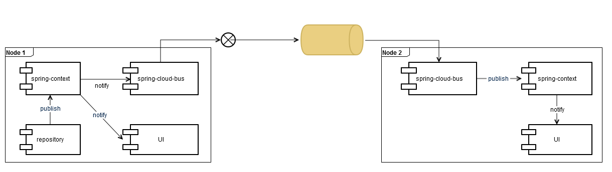

# Clustering

hawkBit is able to run in a cluster with some constraints. This guide provides insights into the basic
concepts and how to setup your own cluster. You can find additional information in the hawkBit runtime’s [README](https://github.com/eclipse-hawkbit/hawkbit/blob/master/hawkbit-monolith/hawkbit-update-server/README.md).

---

### Big picture
<p align="center">
  
</p>

---

### Events

Event communication between nodes is based on [Spring Cloud Bus](https://cloud.spring.io/spring-cloud-bus/) and [Spring Cloud Stream](http://docs.spring.io/spring-cloud-stream/docs/current/reference/htmlsingle/).  
There are different binder implementations available. The hawkBit Update Server uses the **RabbitMQ binder**.  
Every node gets its own queue to receive cluster events, the default payload is JSON. If an event is thrown locally at one node, it will be automatically delivered to all other available nodes via the Spring Cloud Bus’s topic exchange.


<p align="center">
  
</p>
Via the `ServiceMatcher` you can check whether an event happened locally at one node or on a different node:

```java
serviceMatcher.isFromSelf(event)
```

---

### Caching

Every node is maintaining its own caches independent from other nodes.  
So there is no globally shared/synchronized cache instance within the cluster.  

In order to keep nodes in sync, a **TTL (time to live)** can be set for all caches to ensure that after some time the cache is refreshed from the database.  
To enable the TTL just set the property `hawkbit.cache.global.ttl` (value in milliseconds).  

Of course, you can implement a shared cache, e.g. Redis. See [CacheAutoConfiguration](https://github.com/eclipse-hawkbit/hawkbit/blob/master/hawkbit-autoconfigure/src/main/java/org/eclipse/hawkbit/autoconfigure/cache/CacheAutoConfiguration.java).

---

### Schedulers

Every node has multiple schedulers which run after a defined period of time.  
All schedulers always run on every node.  

This has to be kept in mind e.g. if the scheduler executes critical code which has to be executed only once.

---

### Known constraints

#### Denial-of-Service (DoS) filter

hawkBit owns the feature of guarding itself from DoS attacks: a **DoS filter**.  
It reduces the maximum number of requests per second which can be configured for read and write requests.  

This mechanism is only working for every node separately, i.e. in a cluster environment the worst-case behaviour would be that the maximum number of requests per second will be increased to its product if every request is handled by a different node.  

The same constraint exists with the validator to check if a user tried too many logins within a defined period of time.  
See [DosFilter](https://github.com/eclipse-hawkbit/hawkbit/blob/master/hawkbit-rest-core/src/main/java/org/eclipse/hawkbit/rest/security/DosFilter.java).
 
