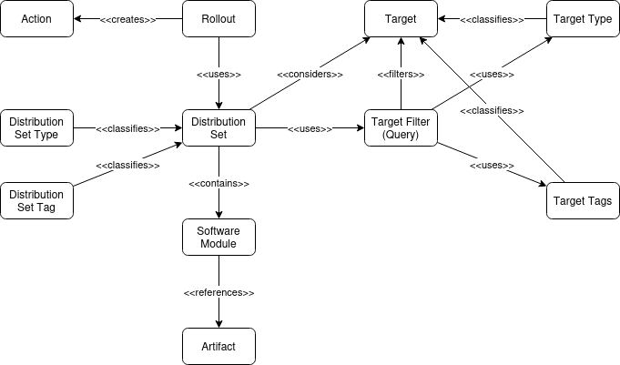

# Data model
The hawkBit data model was designed to have enough flexibility to define complex software structures (e.g. operating
system, runtimes, apps, different kind of artifacts) on one side and simplicity compared to the capabilities of a full
blown configuration management on the other.
<!--more-->

It does define a hierarchy of software that starts with a distribution, which can have (sub-)modules and these may have
multiple artifacts. However, it does not consider any kind of dependency definitions between modules or artifacts. As a
result, dependency checks - if necessary - have to be done outside hawkBit, i.e. on the device itself or before the
entity creation in hawkBit by the origin.

---

## Provisioning Target Definition

A Provisioning Target is a neutral definition that may be an actual real device (e.g. gateway, embedded sensor) or a
virtual device (e.g. vehicle, smart home).

The definition in hawkBit might reflect the transactional behavior if necessary on the device side. A vehicle might be
updated device by device or as a whole. As a result one way of defining a vehicle in hawkBit could be to have one all
inclusive Software Module or one module per (sub-) device.

A Target can have, next to its defined properties (e.g. controller ID, target type, name, description, security token),
a generic set of attributes and meta data, both in key:value format. Target attributes are owned and managed by the
device whereas target meta data are managed by the operator. If a target is defined to be of a certain target type, then
during the assignment of a distribution set, a compatibility check will be performed between the target type and
distribution set type.

---

## Software Structure Definition

The structure defines the model of the supported software by the provisioning target

- Distribution Set Type:defines a package structure that is supported by certain devices
- Consists of Software Module Types both for
    - Firmware - device can have only one module of that type (e.g. the operating system)
    - Software - device can have multiple modules of that type (e.g. "Apps")

Software Content Definition:

- Distribution Set: can be deployed to a provisioning target
- Software Module: is a sub element of the distribution, e.g. OS, application, firmware X, firmware Y
- Artifact: binaries for a software module. Note: the decision which artifacts have to be downloaded are done on the
  device side, e.g. Full package, signatures, binary deltas

---

## Entity Relationships

The public defined entities and their relation which are reflected by the Management API.

  

| Entity | Role |
|---|---|
| Action | Action delivered from backend to target side and potentially executed on a target. Can have an execution status of `closed`, `proceeding`, `canceled`, `scheduled`, `rejected`, `resumed`, `downloaded`, `download`. Can have a result of `success`, `failure`, `none`. |
| Artifact | Update data + metadata delivered to targets. |
| Distribution Set | Subset of targets used during a rollout. |
| Software Module | Child entity of distribution set. |
| Rollout | Root entity (overall backend side state machine). |
| Target | A physical device. |

Information about the Rollout related behavior can be found in
[Rollout management](https://eclipse.dev/hawkbit/concepts/rollout-management/).
Information about target side behavior can be found in
[Target State Machine](https://eclipse.dev/hawkbit/concepts/targetstate/).
The behavior shown in *Target State Machine* needs to be implemented in the
update client used on target side (behavioral interface specification for
update clients).

Additional information required to understand the high level functionality:

| Type | Role |
|---|---|
| Action Type | Type of the action (`SOFT`, `FORCED`, `TIMEFORCED`, `DOWNLOAD_ONLY`). |
| Action Cancelation Type | Type of action cancelation responded from target to backend side via a DDI API feedback endpoint `SOFT`, `FORCE`, `NONE`. |
| Distribution Set Tag | Allows classification of distribution set. |
| Distribution Set Type | Allows classification of distribution set (according to type). Builtin are `os_app`, `os`, `app`. |
| Target Tag | Allows classification of target (e.g. for grouping, indicating target roles, ...). |
| Target Type | Allows classification of target (optional). |

---

## Deleting and Archiving Software Modules

When a user deletes a Software Module, the update server cannot simply remove all the corresponding data. Because when
the Software Module is already assigned to a Distribution Set or was assigned to a Target in the past, the hawkBit
server has to make sure that remains a clean and full update history for every target. The history contains all
information (e.g. name, version) of the software, which was assigned to a specific Target. Obviously storing the binary
data of the artifacts is not necessary for the history purpose.

The delete process which is performed, when there are historical connections to targets is called SoftDelete. This
process marks the Software Module as deleted and removes the artifact, but it won't delete the meta data, which
describes the SoftwareModule and the associated Artifacts. SoftwareModules, which are marked as delete won't be visible
for the user, when he is requesting all SoftwareModules.

Just in case there are no connections to Distribution Sets and targets the server will perform a HardDelete. This
process deletes all stored data, including all meta information.

> In case of a SoftDelete the unique constraints are still in place, i.e. you cannot create an entity with the same
> name/key. This constraint might be removed in future versions because of the impact on the user experience (i.e. he does
> not see the soft deleted module but cannot create a new one).
