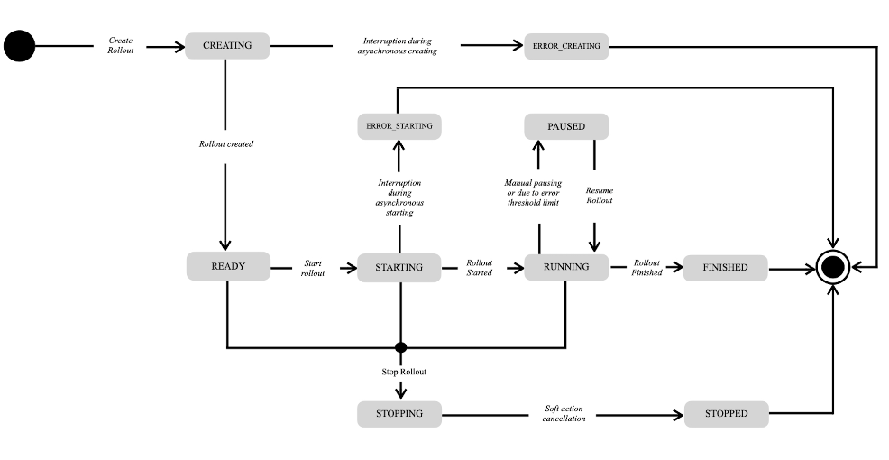
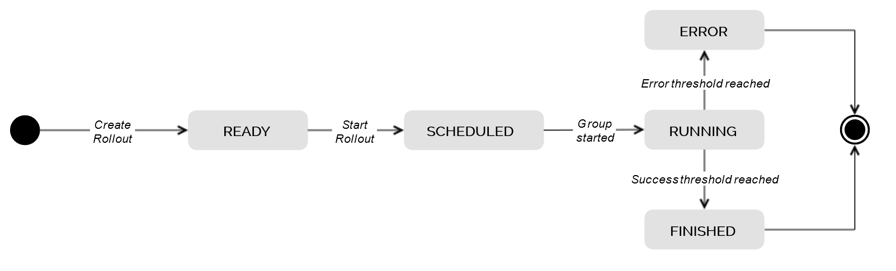

# Rollout management
Software update operations in large scale IoT scenarios with hundreds of thousands of devices require special handling.

That includes:

- _Technical Scalability_ by means of horizontal scale of the hawkBit server cluster in the cloud.
- _Global_ artifact _content delivery_ capacities.
- _Functional Scalability_ by means of:
    - Secure handling of large volumes of devices at rollout creation time.
    - Monitoring of the rollout progress.
    - Emergency rollout shutdown in case of problems on to many devices.

- Reporting capabilities for a complete understanding of the rollout progress at each point in time.

Eclipse hawkBit sees these capabilities under the term Rollout Management.

The following capabilities are currently supported by the _Rollout Management_:

- Create, update and start of rollouts.
    - Selection of targets as input for the rollout based on _target filter_ functionality.
    - Selection of a _DistributionSet_.
    - Auto-splitting of the input target list into a defined number deployment groups.
- Approval workflow
    - Has to be enabled explicitly in configuration.
    - Enables a workflow that requires a user with adequate permissions to review any new or updated rollout before it
      can be started.
    - Allows integration with 3rd party workflow engines.

- Cascading start of the deployment groups based on installation status of the previous group.
- Emergency shutdown of the rollout in case a group exceeds the defined error threshold.
- Rollout progress monitoring for the entire rollout and the individual groups.

---

## Cascading Deployment Group Execution

The cascading execution of the deployment groups is based on two thresholds that can be defined by the rollout creator.

- **Success Condition**: Defined by the percentage of successfully installed targets in the current group. When this threshold is reached, a success action is executed.
    - (Default) **NextGroup** success action, enabling a fully cascading rollout, starting the next group automatically.
    - **Pause** success action allows the rollout to pause after a group’s success condition is met, enabling additional external verification or manual checks before proceeding. The rollout will await a manual resume action, which then starts the next group.
- **Error Condition**: Defined by an absolute number or percentage of failed installations. This triggers an emergency shutdown of the entire rollout.

---

## Rollout state machine

### State Machine on Rollout

  

### State Machine on Rollout Deployment Group

  

---

## Multi-Assignments (beta)

One of the main paradigms of Eclipse hawkBit is, that a Distribution Set represents the currently installed software of
a device. Hence, a device can have only one Distribution Set assigned/installed at a time. With _Multi-Assignments_
enabled, this paradigm shifts. Multi-Assignments allows to assign multiple Distribution Sets to a device simultaneously,
without cancelling each other. As a consequence, an operator can trigger multiple campaigns addressing the same devices
in parallel.

### Action weight

To differentiate between important and less important updates a property called _weight_ is used. When multi-assignments
is enabled every action has a weight value between (and including) 0 and 1000. The higher the weight the more important
is the assignment represented by the action. Also when defining a _rollout_ or an _auto-assignment_ and
multi-assignments is enabled a weight value has to be provided. This value is passed to the actions created during the
execution of these _rollouts_ and _auto-assignments_. If no weight was provided the highest value of 1000 is used
instead.

### Consequences

While this feature provides more flexibility to the user and enables new use-cases, there are also some consequences one
should be aware of:

**Critical**

* This feature is in beta and may change unannounced.
* For now, this feature is **opt-in only**. Once activated, it cannot be deactivated.

**Minor**

* While on DMF-API a MULTI_ACTION request is sent, DDI-API only exposes the next action which has the highest priority
  in the list of open actions(according to their weight property).
* All information regarding the currently assigned or installed Distribution Set does only respect the last assignment,
  as well as the last successfully installed Distribution set. This also affects:
    * Pinning a target or Distribution Set in Deployment View.
    * Statistics about installed or assigned Distribution Sets.
* Auto close running actions, when a new Distribution Set is assigned (`repository.actions.autoclose.enabled`) is
  deactivated.
* Marking a Distribution Set to be a *Required Migration Step* is deactivated.
