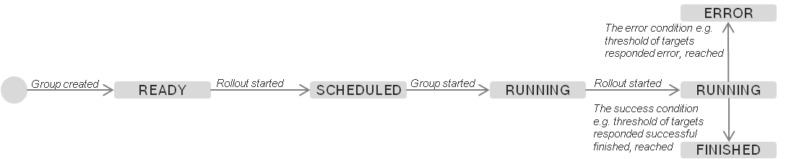



Software update operations in large scale IoT scenarios with hundreds of thousands of devices require special handling.

That includes:
- _Technical Scalability_ by means of horizontal scale of the _hawkBit_ server cluster in the cloud.
- _Global_ artifact _content delivery_ capacities.
- _Functional Scalability_ by means of:
  - Secure handling of large volumes of devices at rollout creation time.
  - Monitoring of the rollout progress.
  - Emergency rollout shutdown in case of problems on to many devices.

- Reporting capabilities for a complete understanding of the rollout progress at each point in time.

Eclipse _hawkBit_ sees these capabilities under the term Rollout Management.

The following capabilities are currently supported by the _Rollout Management_:
- Create, update and start of rollouts.
  - Selection of targets as input for the rollout based on _target filter_ functionality.
  - Selection of a _DistributionSet_.
  - Auto-splitting of the input target list into a defined number deployment groups.

- Cascading start of the deployment groups based on installation status of the previous group.
- Emergency shutdown of the rollout in case a group exceeds the defined error threshold.
- Rollout progress monitoring for the entire rollout and the individual groups.

## Cascading Deployment Group Execution
The cascading execution of the deployment groups is based on two thresholds that can be defined by the rollout creator.
- success condition by means of percentage of successfully installed targets in the current groups triggers.
- error condition by means of absolute or percentage of failed installations which triggers an emergency shutdown of the entire rollout.

[[images/DeploymentGroups.png]]

## Rollout state machine
### State Machine on Rollout
{:width="100%" .image-center}

### State Machine on Rollout Deployment Group
{:width="100%" .image-center}
