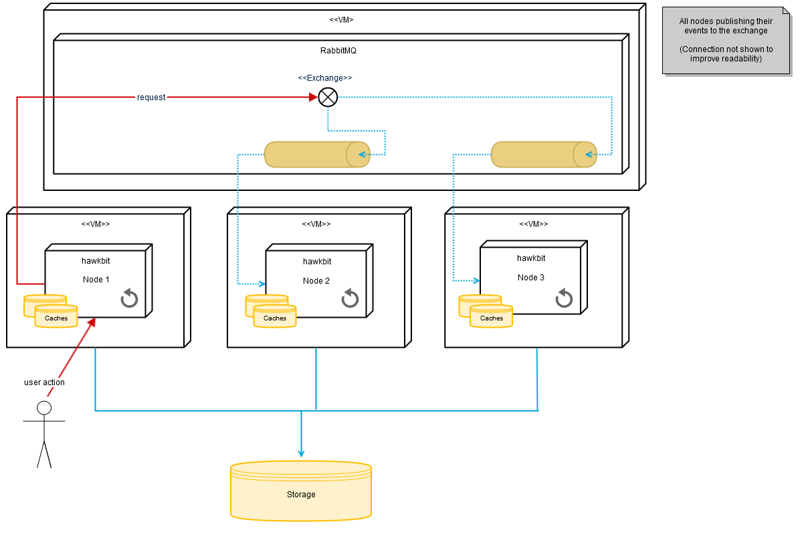
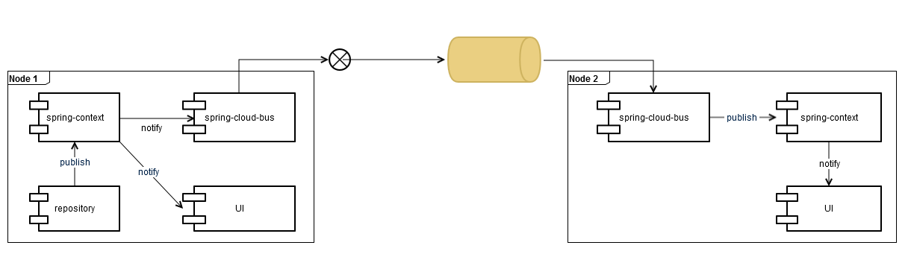



# Cluster

_hawkBit_ is able to run in a cluster with some constraints. This guide provides insights in the basic concepts and how to setup your own cluster. You can find additional information in the [hawkbit runtimes's README](https://github.com/eclipse/hawkbit/blob/master/hawkbit-runtime/hawkbit-update-server/README.md).

# Big picture

{:width="100%"}

# Events

Event communication between nodes is based on [Spring Cloud Bus](https://cloud.spring.io/spring-cloud-bus/) and [Spring Cloud Stream](http://docs.spring.io/spring-cloud-stream/docs/current/reference/htmlsingle/). There are different [binder implementations](http://docs.spring.io/spring-cloud-stream/docs/current/reference/htmlsingle/#_binders) available. The _hawkbit Update Server_ uses RabbitMQ binder. Every node gets his own queue to receive cluster events, the default payload is JSON.
If an event is thrown locally at one node, it will be automatically delivered to all other available nodes via the Spring Cloud Bus's topic exchange:

{:width="100%"}

Via the ServiceMatcher you can check whether an event happened locally at one node or on a different node.
`serviceMatcher.isFromSelf(event)`

# Caching

Every node is maintaining its own caches independent from other nodes. So there is no globally shared/synchronized cache instance within the cluster. In order to keep nodes in sync a TTL (time to live) can be set for all caches to ensure that after some time the cache is refreshed from the database. To enable the TTL just set the property "hawkbit.cache.global.ttl" (value in milliseconds). Of course you can implement a shared cache, e.g. Redis.
See [CacheAutoConfiguration](https://github.com/eclipse/hawkbit/blob/master/hawkbit-autoconfigure/src/main/java/org/eclipse/hawkbit/autoconfigure/cache/CacheAutoConfiguration.java)

# Schedulers

Every node has multiple schedulers which run after a defined period of time. All schedulers always run on every node. This has to be kept in mind e.g. if the scheduler executes critical code which has to be executed only once.

# Known constraints

## UI sessions
As of today _hawkBit_ isn't storing user sessions in a shared, clusterwide cache. Session is only bound to the node where the login took place. If this node is going down for whatever reason, the session is lost and the user is forced to login again.
In case that's not an option, you can help yourself by introducing a shared session cache based on e.g. Redis.
Furthermore _hawkBit_ isn't supporting session stickiness out of the box either. However most of the well known load balancers out there can solve this issue.

## Caching of download IDs
The downloadId is generated and stored in the DownloadIdCache. It is used for downloading an artifact.
In _hawkbit_ exists an interface called "[DownloadIdCache](https://github.com/eclipse/hawkbit/blob/master/hawkbit-core/src/main/java/org/eclipse/hawkbit/cache/DownloadIdCache.java)" and one implementation of it: "DefaultDownloadIdCache". This default implementation can't be used within a cluster. Its containing data is only available inside one node and can't be shared with other nodes. E.g. the downloadId which is stored in this cache after authentication on node A can only be used for downloading the artifact by node A.
In a cluster-capable environment this fact can lead to issues as it could happen, that the downloadId is stored on node A and node B would like to download the artifact by means of the downloadId which is not available on node B. To solve this issue you can use a cluster-shared cache e.g. Redis or create a new cluster-aware implementation of the interface "DownloadIdCache".

## Denial-of-Service (DoS) filter
_hawkbit_ owns the feature of guarding itself from DoS attacks, a [DoS filter](https://github.com/eclipse/hawkbit/blob/master/hawkbit-security-core/src/main/java/org/eclipse/hawkbit/security/DosFilter.java). It reduces the maximum number of requests per seconds which can be configured for read and write requests.
This mechanism is only working for every node separately, i.e. in a cluster environment the worst-case behaviour would be that the maximum number of requests per seconds will be increased to its product if every request is handled by a different node.
The same constraint exists with the validator to check if a user tried too many logins within a defined period of time.
