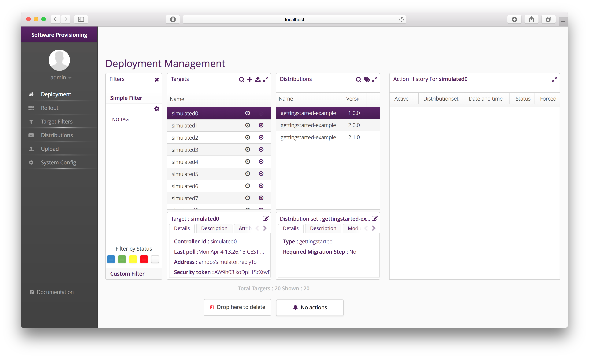



# Run hawkBit

In this guide we describe how to run a full featured hawkBit setup based on a production ready infrastructure. It is based on the _hawkBit_ example modules and update server.

Note: the update server can in fact be run [stand alone](https://github.com/eclipse/hawkbit/tree/master/hawkbit-runtime/hawkbit-update-server). However, only with an embedded H2, no [Device Management Federation API](../interfaces/dmf-api.html) and no artifact storage.

This guide will focus on a complete setup that includes all _hawkBit_ features.

# System Architecture
This guide describes a target architecture that is more like one that you will expect in a production system.

- hawkBit [Update Server](https://github.com/eclipse/hawkbit/tree/master/hawkbit-runtime/hawkbit-update-server).
- [MariaDB](https://mariadb.org) for the repository.
- [RabbitMQ](https://www.rabbitmq.com) for DMF communication.
- For testing and demonstration purposes we will also use:
 - [hawkBit Device Simulator](https://github.com/eclipse/hawkbit-examples/tree/master/hawkbit-device-simulator).
 - [hawkBit Management API example client](https://github.com/eclipse/hawkbit-examples/tree/master/hawkbit-mgmt-api-client).

# Prerequisites
- You have a working [hawkBit core build](https://github.com/eclipse/hawkbit).
- You have a working [hawkBit examples build](https://github.com/eclipse/hawkbit-examples).

# Steps

## Adapt hawkBit Update Server and Device Simulator to your environment.

As mentioned you can create your own application with _hawkBit_ inside or adapt the existing example app. The second option will be shown here.

### Set MariaDB dependency to compile in the [update server POM](https://github.com/eclipse/hawkbit/blob/master/hawkbit-runtime/hawkbit-update-server/pom.xml)

<dependency>
  <groupId>org.mariadb.jdbc</groupId>
  <artifactId>mariadb-java-client</artifactId>
  <scope>compile</scope>
</dependency>


### Configure MariaDB/MySQL connection settings.

For this you can either edit the existing *application.properties* or create a [new profile](http://docs.spring.io/spring-boot/docs/current/reference/htmlsingle/#boot-features-external-config-profile-specific-properties).


spring.jpa.database=MYSQL
spring.datasource.url=jdbc:mysql://localhost:3306/YOUR_SCHEMA
spring.datasource.username=YOUR_USER
spring.datasource.password=YOUR_PWD
spring.datasource.driverClassName=org.mariadb.jdbc.Driver


### Configure RabbitMQ connection settings for update server and device simulator (optional).

We provide already defaults that should work with a standard Rabbit installation. Otherwise configure the following in the `application.properties` of the two services:


spring.rabbitmq.username=guest
spring.rabbitmq.password=guest
spring.rabbitmq.virtualHost=/
spring.rabbitmq.host=localhost
spring.rabbitmq.port=5672


### Adapt hostname of example scenario [creation script](https://github.com/eclipse/hawkbit-examples/blob/master/hawkbit-example-mgmt-simulator/src/main/resources/application.properties)

Should only be necessary if your system does not run on localhost or uses a different port than the example app.

Adapt `application.properties` in this case:

hawkbit.url=localhost:8080


or provide the parameter on command line:

hawkbit-example-mgmt-simulator-##VERSION##.jar --hawkbit.url=YOUR_HOST:PORT


## Compile & Run

### Compile & Run your _"production ready"_ app.

see [update server](https://github.com/eclipse/hawkbit/tree/master/hawkbit-runtime/hawkbit-update-server)

### Compile & Run example scenario [creation script](https://github.com/eclipse/hawkbit-examples/tree/master/hawkbit-example-mgmt-simulator) (optional).

This has to be done before the device simulator is started. _hawkBit_ creates the mandatory tenant metadata with first login into either _Management UI_ or API (which is done by this client).

However, this is not done by _DMF_ which is in fact used by the device simulator, i.e. without calling _Management API_ first _hawkBit_ would drop all _DMF_ messages as the tenant is unknown.

### Compile & Run device simulator (optional).

see [device simulator](https://github.com/eclipse/hawkbit-examples/tree/master/hawkbit-device-simulator)

## Enjoy hawkBit with a real database, artifact storage and all [interfaces](../interfaces/interfaces.html) available.

{:width="100%"}
