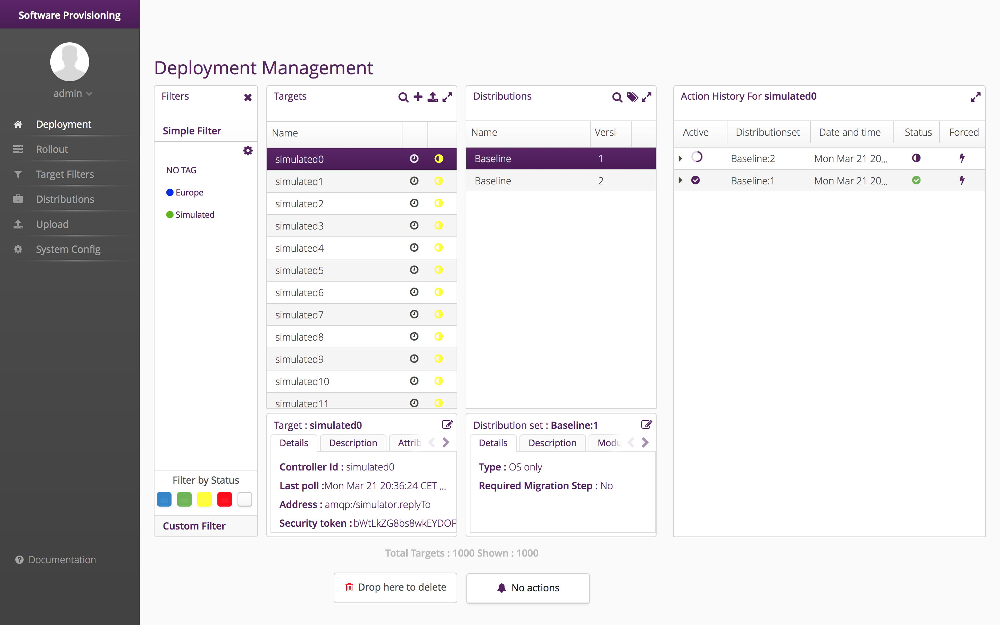
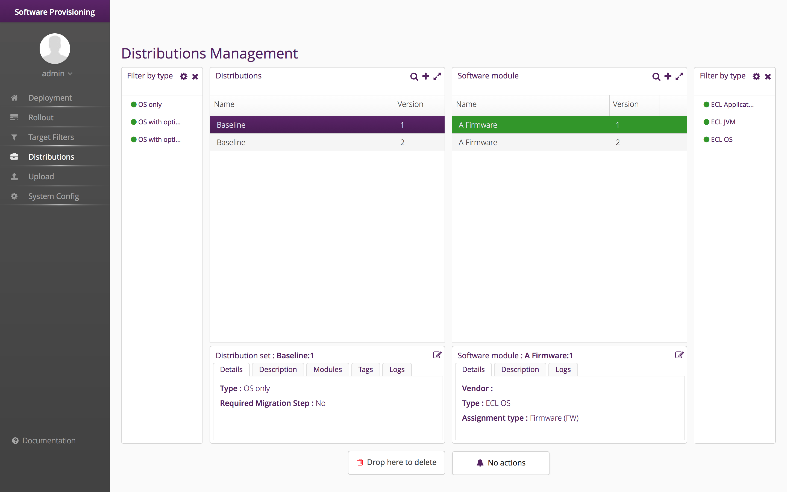
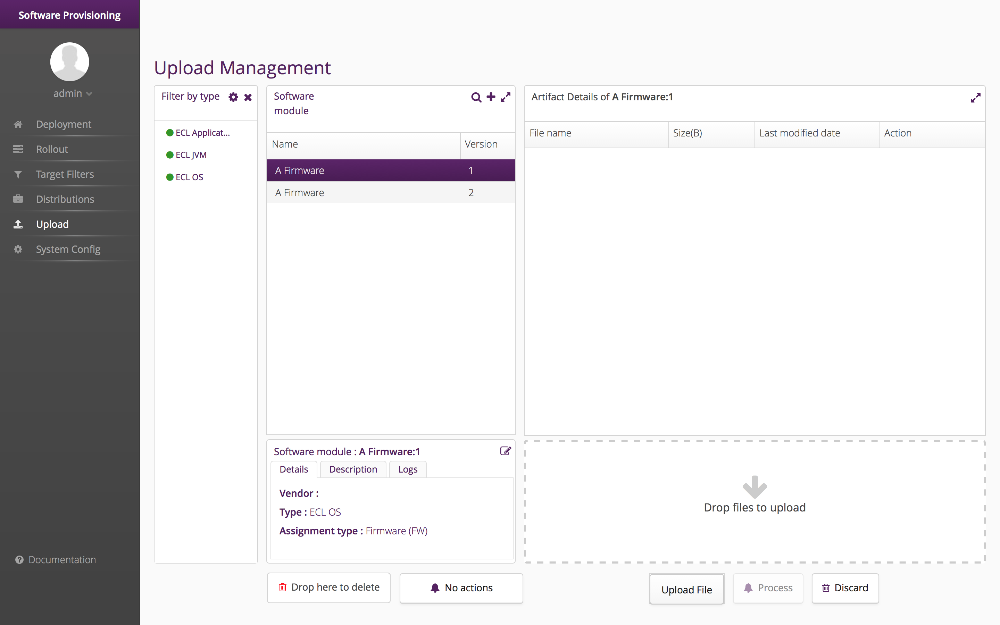
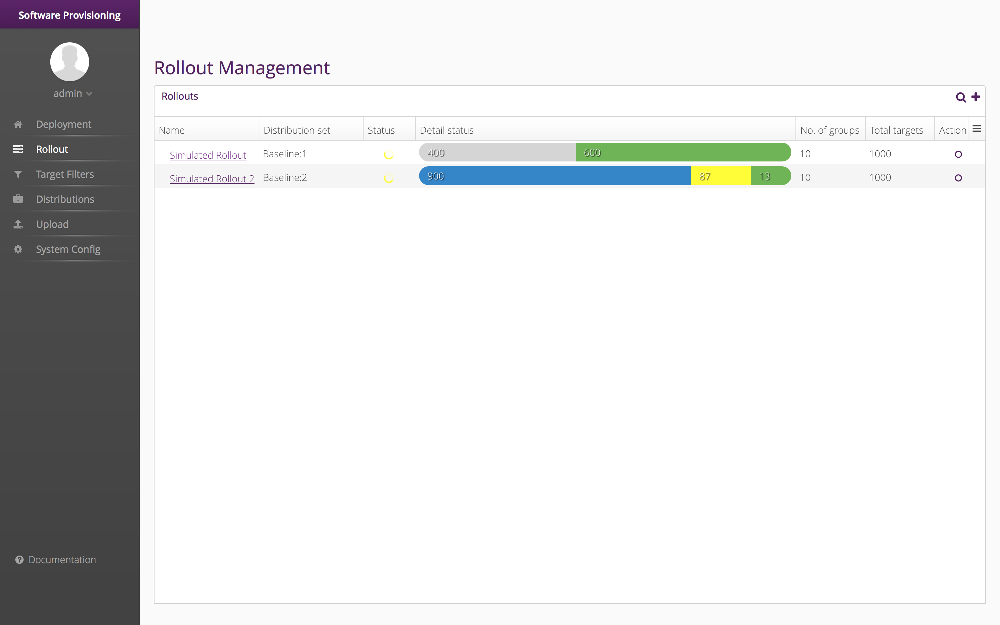
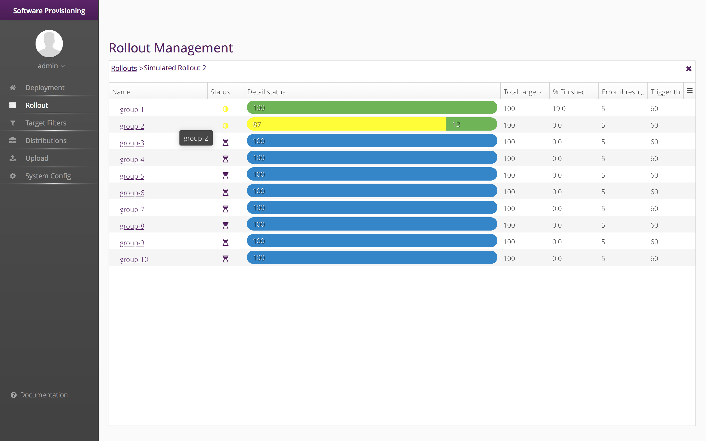
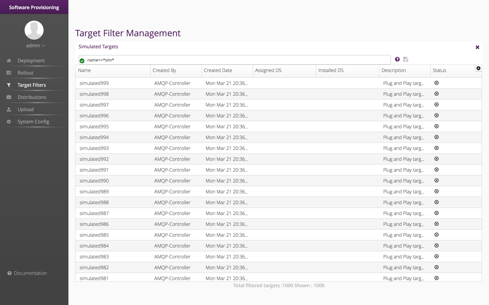



The _hawkBit_ Management UI provides several views for the different use cases:

- _Deployment Management_ view for target administration and manual deployment.
- _Distribution Management_ view software repository metadata management.
- _Artifact Management_ view to manage the artifacts.
- _Target Filter Management_ view to manage target filters that can be used both in Deployment and Rollout Management views.
- _Rollout Management_ for large scale rollout orchestration.

# Deployment Management

## Purpose

Target status overview, target management and manual deployments.

## Feature explained
- Target Status: check status of all targets.
- Target list allows filters based on:
  - Assigned/installed _DistributionSet_ (drag and drop a set on the filter icon on the top of the list)
  - Target update status: click 1-X status to reduce the list of targets that have one of them.
  - Target tag: click 1-X tags to reduce the list to targets that have one of them.
  - Name, description: use search button on the top of the list.

- _DistributionSet_ list allows filters based on:
  - _DistributionSet_ tag: click 1-X tags to reduce the list of sets that have one of them.
  - Name, description: use search button on the top of the list.

- Start roll out by drag and drop targets on a DS.
- Target list supports CTRL-A for "select all".
- Delete sets, tags or targets by dragging them on delete icon.
- Select _Target_ to see _Action_ History.
- Bulk target upload: create bulk targets by upload.


Hints for bulk upload:
- Expected file type : csv.
- Expected file format : Each line with two values (ControllerID,Target Name). ControllerID is mandatory.
- Example:
```
Controller_id_1,targetName1
Controller_id_2,targetName2
```

{:width="100%"}

# Distribution Management

## Purpose

Distribution Set view to manage software repository metadata, i.e. Distribution Sets, their Software Modules and the respective types.

## Features explained
- Browse, create, delete and update Distribution Sets.
- Browse, create, delete and update Distribution Set Types.
- Browse, create, delete and update Software Modules.
- Browse, create, delete and update Software Module Types.
- Assign Software Modules to Distribution Sets.

{:width="100%"}

# Artifact Management

## Purpose
Software artifact management, both metadata (i.e. Software Modules) and artifacts themselves.

## Features explained
Allows to:
- Browse, create, delete and update Software Modules.
- Browse, create, delete and update Software Module Types.
- Upload and delete software artifacts for a module.

{:width="100%"}

# Rollout Management

## Purpose
Software rollout in large scale, rollout status overview and rollout management.

## Features explained
- Create, update, copy and delete of rollouts.
- Start, pause and resume of rollouts.
- Progress monitoring for the entire rollout and the individual groups.
- Drill down to see the groups in a rollout and targets in each group.
- Rollout attributes:
  - Selection of targets as input for the rollout based on _target filter_
  - Selection of _distribution set_
  - Auto-splitting of the input target list based on _group number_ defined
  - _Trigger threshold_ to define the percentage of installation to be completed , to trigger the start of next group
  - _Error threshold_ defines the percentage of error tolerance of a group before calling for a emergency shutdown of a rollout

{:width="100%"}

{:width="100%"}

## Note
- Deletion of targets which are in a rollout, changes the rollout statistics.

# Target Filter Management

## Purpose
Custom target filter overview and filter management.

## Features explained
- Custom target filter allows user to filter targets by defining custom query.
- Displays custom target filter list and user can search any particular filter.
- Create, update and delete features are supported for target filters.

## How to Filter
The basic syntax to filter is: `field<basic_operator>value <composite_operator> field<basic_operator>value <...>`
- `field`: is the name of the resource field.
- `value`: is the value of the target field
- `<basic_operator>`: Are operators to do simple queries. Supported basic operators are:
  - `==` : equal
  - `!=` : not equal
  - Use `=IN=` for 'in' parameter.(Example: name=IN=(target1,target2).

- `<composite_operator>`: Are operators to join simple queries: Supported composite operators are:
  - `and`
  - `or`
  - Use `=IN=` for 'in' parameter.(Example: name=IN=(target1,target2).
  - Use `*` for wildcard matches.

## Examples

Custom query                                                                               | Description
------------------------------------------------------------------------------------------ | -----------------------------------------------------------------------------------------------------------------------------------------------------
updatestatus==error                                                                        | Gives all targets in ‘error’ state.
controllerId!=192.168.2.42                                                                 | Gives all targets that don't have the controllerId 192.168.2.42.
name==\*CCU\*                                                                              | Gives all targets which contain the term ‘CCU’ in there name.
name==\*CCU\* or description==\*CCU\*                                                      | Gives all targets that either have the term ‘CCU’ in their name or their description.
name==\*SHC\* and description==\*SHC\*                                                     | Gives all targets that have the term SHC in their name and their description.
name==CCU* and updatestatus==pending                                                       | Gives all targets with their name starting with ‘CCU’ and which are in ‘pending’ state.
(assignedds.name==‘ECU-DS’ and description==test) or updatestatus!=error                   | Gives all targets which are either assigned to ‘ECU-DS’ and have description equals to ‘test’ or which are not in error status.
(updatestatus!=In\_sync or updatestatus!=error) and name==\*SHC1\*                         | Gives all targets that don't have the updatestatus In\_sync or error and that contains the term SHC1 in their name.
(updatestatus!=error or updatestatus!=pending) and (name==\*CCU\* or description==\*CCU\*) | Gives all targets that either have the term ‘CCU’ in their name or their description and that either have the _update status_ not in state error or pending.

{:width="100%"}
