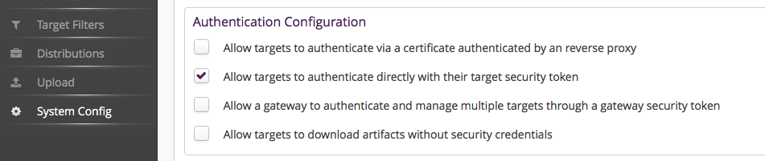



# Security

## Authentication
A _hawkBit_ update server can be accessed in four different ways:
- _Direct Device Integration (DDI) API_ by **targets**.
- _Management API_ by 3rd party **applications**.
- _Device Management Federation (DMF) API_ by 3rd party **applications** through AMQP.
- _Management UI_ by **users**.

### DDI API Authentication Modes

#### Security Token

_hawkBit_ supports multiple ways to authenticate a target against the server. The different authentication modes can be individual enabled and disabled within _hawkBit_. Both on system level (with Spring Boot properties) as per individual tenant.

##### Target Security Token Authentication
There is a 32 alphanumeric character security-token for each created target within IoT _hawkBit_. This token can be used to authenticate the target at _hawkBit_ through the HTTP-Authorization header with the custom scheme _TargetToken_.

```
GET /SPDEMO/controller/v1/0e945f95-9117-4500-9b0a-9c6d72fa6c07 HTTP/1.1
Host: your.hawkBit.server
Authorization: TargetToken bH7XXAprK1ChnLfKSdtlsp7NOlPnZAYY
```

The target security token is provided in [DMF API](../interfaces/dmf-api.html) as part of the update message in order to allow DMF clients to leverage the feature or can it be manually retrieved per target by [Management API](../interfaces/management-api.html) or in the [Management UI](../interfaces/management-ui.html) in the target details.

Note: needs to be enabled in your _hawkBit_ installation **and** in the tenant configuration. That allows both the operator as well as the individual customer (if run in a multi-tenant setup) to enable this access method. See [DdiSecurityProperties](https://github.com/eclipse/hawkbit/blob/master/hawkbit-security-core/src/main/java/org/eclipse/hawkbit/security/DdiSecurityProperties.java) for system wide enablement.

The additional activation for the individual tenant:

{:width="800px"}

##### Gateway Security Token Authentication
Often the targets are connected through a gateway which manages the targets directly and as a result are indirectly connected to the _hawkBit_ update server.

To authenticate this gateway and allow it to manage all target instances under its tenant there is a _GatewayToken_ to authenticate this gateway through the HTTP-Authorization header with a custom scheme _GatewayToken_. This is of course also handy during development or for testing purposes. However, we generally recommend to use this token with care as it allows to act _in the name of_ any device.

```
GET /SPDEMO/controller/v1/0e945f95-9117-4500-9b0a-9c6d72fa6c07 HTTP/1.1
Host: your.hawkBit.server
Authorization: GatewayToken 3nkswAZhX81oDtktq0FF9Pn0Tc0UGXPW
```

Note: needs to be enabled in your _hawkBit_ installation **and** in the tenant configuration. That allows both the operator as well as the individual customer (if run in a multi-tenant setup) to enable this access method. See [DdiSecurityProperties](https://github.com/eclipse/hawkbit/blob/master/hawkbit-security-core/src/main/java/org/eclipse/hawkbit/security/DdiSecurityProperties.java) for system wide enablement.

The additional activation for the individual tenant:

{:width="800px"}

##### Anonymous access
Here we offer general anonymous access for all targets (see [DdiSecurityProperties](https://github.com/eclipse/hawkbit/blob/master/hawkbit-security-core/src/main/java/org/eclipse/hawkbit/security/DdiSecurityProperties.java)) which we consider not really sufficient for a production system but it might come in handy to get a project started in the beginning.

However, anonymous download on the other side might be interesting even in production for scenarios where the artifact itself is already encrypted.

The activation for the individual tenant:

{:width="800px"}

### DMF API
Authentication is provided by _RabbitMQ_ [vhost and user credentials](https://www.rabbitmq.com/access-control.html) that is used for the integration.

### Management API
- Basic Auth

### Management UI
- Login Dialog

## Authorization
Authorization is handled separately for _Direct Device Integration (DDI) API_ and _Device Management Federation (DMF) API_ (where successful authentication includes full authorization) and _Management API_ and _UI_ which is based on Spring security [authorities](https://github.com/eclipse/hawkbit/blob/master/hawkbit-security-core/src/main/java/org/eclipse/hawkbit/im/authentication/SpPermission.java).

However, keep in mind that _hawkBit_ does not offer an off the shelf authentication provider to leverage these permissions and the underlying multi user/tenant capabilities of _hawkBit_. Check out [Spring security documentation](http://projects.spring.io/spring-security/) for further information. In _hawkBit_ [SecurityAutoConfiguration](https://github.com/eclipse/hawkbit/blob/master/hawkbit-autoconfigure/src/main/java/org/eclipse/hawkbit/autoconfigure/security/SecurityAutoConfiguration.java) is a good starting point for integration.

The default implementation is single user/tenant with basic auth and the logged in user is provided with all permissions.

### DDI API
An authenticated target is permitted to:
- retrieve commands from the server
- provide feedback to the the server
- download artifacts that are assigned to it

A target might be permitted to download artifacts without authentication (if enabled, see above). Only the download can be permitted to disable the authentication. This can be used in scenarios where the artifacts itself are e.g. signed and secured.  

### Management API and UI
#### Delivered Permissions
- READ_/UPDATE_/CREATE_/DELETE_TARGETS for:
  - Target entities including metadata (that includes also the installed and assigned distribution sets)
  - Target tags
  - Target actions
  - Target registration rules
  - Bulk operations
  - Target filters

- READ_/UPDATE_/CREATE_/DELETE_REPOSITORY for:
  - Distribution sets
  - Software Modules
  - Artifacts
  - DS tags

- READ_TARGET_SECURITY_TOKEN
  - Permission to read the target security token. The security token is security concerned and should be protected.

- DOWNLOAD_REPOSITORY_ARTIFACT
  - Permission to download artifacts of an software module (Note: READ_REPOSITORY allows only to read the metadata).

- TENANT_CONFIGURATION
  - Permission to administrate the tenant settings.

- ROLLOUT_MANAGEMENT
  - Permission to provision targets through rollouts.

#### Permission Matrix for example uses cases that need more than one permission

Use Case                                                                   | Needed permissions
-------------------------------------------------------------------------- | --------------------------------------------------
Search _targets_ by installed or assigned _distribution set_               | READ_TARGET, READ_REPOSITORY
Assign _DS_ to a _target_                                                  | READ_REPOSITORY, UPDATE_TARGET
Assign DS to target through a _Rollout_, i.e. _Rollout_ creation and start | READ_REPOSITORY, UPDATE_TARGET, ROLLOUT_MANAGEMENT
Read _Rollout_ status including its _deployment groups_                    | ROLLOUT_MANAGEMENT
Checks _targets_ inside _Rollout deployment group_                         | READ_TARGET, ROLLOUT_MANAGEMENT

### Device Management Federation API
The provided _RabbitMQ_ [vhost and user](https://www.rabbitmq.com/access-control.html) should be provided with the necessary permissions to send messages to _hawkBit_ through the exchange and receive messages from it through the specified queue.
