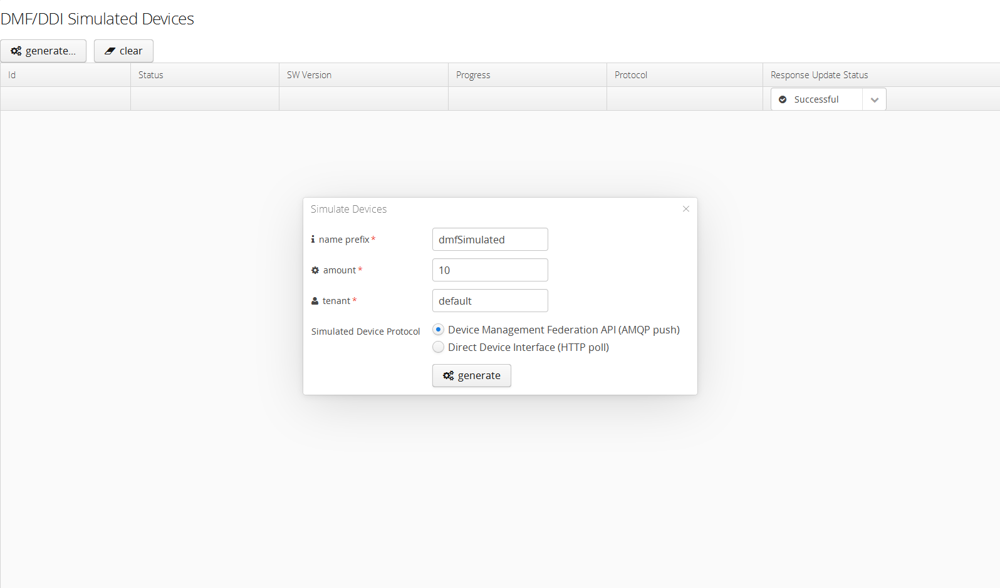
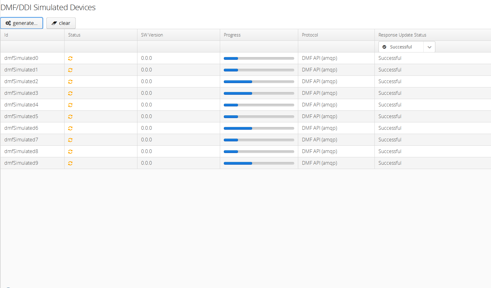
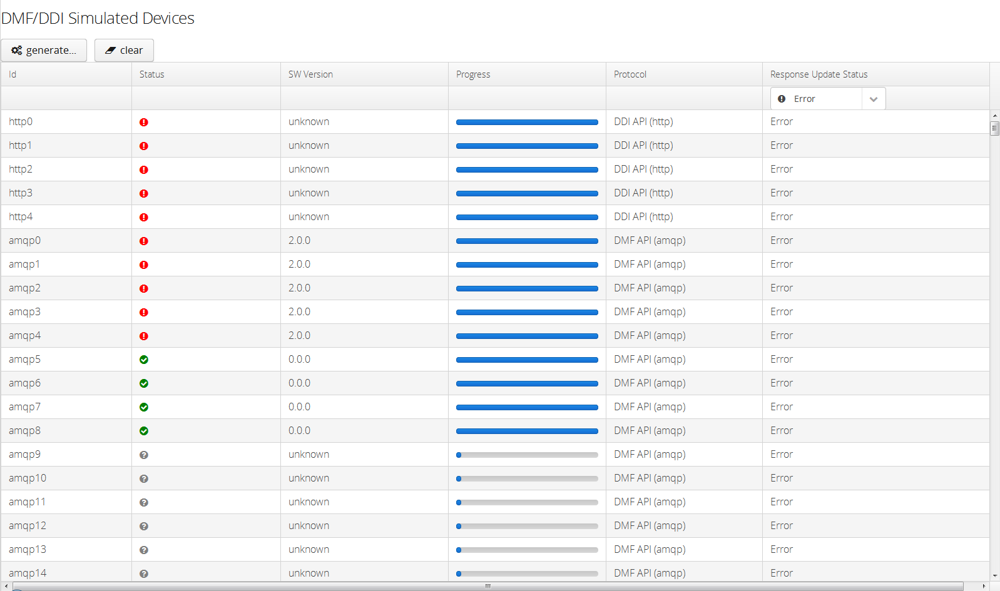

# hawkBit Device Simulator

The device simulator handles software update commands from the update server.

## Run on your own workstation
```
java -jar examples/hawkbit-device-simulator/target/hawkbit-device-simulator-*-SNAPSHOT.jar
```
Or:
```
run org.eclipse.hawkbit.simulator.DeviceSimulator
```

## Deploy to cloud foundry environment

- Go to ```target``` subfolder.
- Run ```cf push```

## Notes

The simulator has user authentication enabled in **cloud profile**. Default credentials:
*  username : admin
*  passwd : admin

This can be configured/disabled by spring boot properties

## hawkBit APIs

The simulator supports `DDI` as well as the `DMF` integration APIs.

In case there is no AMQP message broker (like rabbitMQ) running, you can disable the AMQP support for the device simulator, so the simulator is not trying to connect to an amqp message broker.

Configuration property `hawkbit.device.simulator.amqp.enabled=false`

## Usage

### Graphical User Interface
The device simulator comes with a graphical user interface which makes it very easy to generate dummy devices handled by the device simulator.
The status and the update progress of the simulated device are shown in the UI.
The UI can be accessed via the URL:
```
http://localhost:8083
```

 

 

 


### REST API
The device simulator exposes an REST-API which can be used to trigger device creation.

Optional parameters:
* name : name prefix simulated devices (default: "dmfSimulated"), followed by counter
* amount : number of simulated devices (default: 20, capped at: 4000)
* tenant : in a multi-tenenat ready hawkBit installation (default: "DEFAULT")
* api : the API which should be used for the simulated device either `dmf` or `ddi` (default: "ddi")
* endpoint :  URL which defines the hawkbit DDI base endpoint (deffault: "http://localhost:8080")
* polldelay : number in milliseconds of the delay when DDI simulated devices should poll the endpoint (default: "30")
* gatewaytoken : an hawkbit gateway token to be used in case hawkbit does not allow anonymous access for DDI devices (default: "")


Example: for 20 simulated devices (default)
```
http://localhost:8083/start
```

Example: for 10 simulated devices that start with the name prefix "activeSim":
```
http://localhost:8083/start?amount=10&name=activeSim
```

Example: for 5 simulated devices that start with the name prefix "ddi" using the Direct Device Integration API (http) authenticated by given gateway token, a pool interval of 10 seconds and a custom port for the DDI service.:
```
http://localhost:8083/start?amount=5&name=ddi&api=ddi&gatewaytoken=d5F2mmlARiMuMOquRmLlxW4xZFHy4mEV&polldelay=10&endpoint=http://localhost:8085
```
